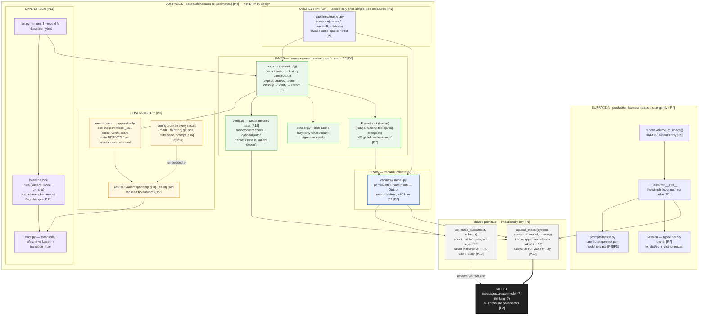

# gently-perception mapped onto the agent-harness definition

> An agent harness is the layer of software that sits around a model and turns
> raw inference into an agent — it runs the loop (call model → parse output →
> execute tools → feed results back → repeat), and carries everything the model
> needs to operate in an environment.

In this repo the "loop" is **temporal** (iterate frames of a developing embryo),
not tool-use. Each step: render frame → call model → parse stage → append to
history → next frame sees that history. The "tool result fed back" is the
model's own previous prediction.

---

## The harness, by component

```mermaid
graph TB
    MODEL["MODEL<br/>anthropic.Anthropic().messages.create<br/>(reasoning only — everything else is harness)"]

    %% ---------------- LOOP ----------------
    subgraph LOOP["1 · AGENT LOOP / ORCHESTRATION"]
        direction TB
        RUNLOOP["run.py :: run_variant()<br/>for embryo → for timepoint:<br/>perceive() → parse → append history → next<br/><i>(the canonical loop)</i>"]
        PERCEIVER["gently_perception/perceiver.py :: Perceiver.__call__<br/>same loop, OO, per-embryo Session<br/><i>(production wrapper, duplicate impl)</i>"]
        MULTITURN["_base.py :: call_claude_conversation()<br/>multi-turn within one frame<br/><i>(used by *_multishot — negative result)</i>"]
    end

    %% ---------------- PROMPT / TOOLS ----------------
    subgraph PROMPT["2 · SYSTEM PROMPT + TOOL DEFINITIONS"]
        direction TB
        SYSPROMPTS["perception/{variant}.py :: SYSTEM_PROMPT<br/>~29 variants, one string each<br/>hybrid.py routes between TEMPORAL/SCIENTIFIC"]
        OUTFMT["Output schema: free-text JSON<br/>{stage, reasoning}<br/>parsed by _base.parse_stage_json()<br/><i>(no structured tool_use — regex+brace fallback)</i>"]
        TOOLS["Tool definitions: NONE active<br/>tools (3D rotate, prev-frame) tried in gently<br/>baseline → 23% vs 35% → removed"]
    end

    %% ---------------- CONTEXT ----------------
    subgraph CTX["3 · CONTEXT MANAGEMENT"]
        direction TB
        HIST["history[] — model's own past predictions<br/>_base.build_history_text() → last 3<br/>Session.history → last 5<br/><i>(hard truncation = compaction policy)</i>"]
        REFS["references — 2 example imgs/stage<br/>_base.build_reference_content()<br/>cache_control: ephemeral 1h"]
        PCACHE["Prompt caching<br/>system block + final ref block<br/>tagged cache_control 1h TTL"]
        GTLEAK["⚠ GT-for-skipped-frames injected into<br/>same history[] (run.py:138-143)<br/>— the leak surface"]
    end

    %% ---------------- SUBAGENTS ----------------
    subgraph SUB["4 · SUBAGENTS / STRUCTURED HANDOFFS"]
        direction TB
        VOTE["vote3_mm.py — 3× self-consistency,<br/>majority vote (variance ↓ 4.8→0.5)"]
        ENSEMBLE["ensemble.py — N variant calls → vote"]
        JUDGE["experiments/judge_ensemble/*.py<br/>expert A + expert B → judge arbitrator<br/><i>(ad-hoc scripts, OUTSIDE harness)</i>"]
        ZSUB["zslice*.py — segment-count subcall<br/>overrides main classification<br/><i>(negative result)</i>"]
        ROUTE["hybrid.py :: _get_system_prompt()<br/>route prompt by predicted last stage<br/><i>(handoff between prompt 'personas')</i>"]
    end

    %% ---------------- ENV ----------------
    subgraph ENV["5 · EXECUTION ENVIRONMENT"]
        direction TB
        RENDER["benchmark/testset.py<br/>TIFF volume → 5 image renders<br/>(3-view, top, side, midplane, z-stack)<br/><i>the model's 'sensors'</i>"]
        SECRETS["anthropic.Anthropic()<br/>reads ANTHROPIC_API_KEY from env"]
        NOSAND["No sandbox/VM — pure API,<br/>no code execution by model"]
    end

    %% ---------------- STATE ----------------
    subgraph STATE["6 · SESSION STATE & CACHING"]
        direction TB
        SESSION["perceiver.Session<br/>observations[] + images{tp→b64}<br/>to_dict/from_dict for restart"]
        RUNHIST["run.py :: history list<br/>same state, inline, not persisted"]
        RESULTS["data/results/{variant}_{stages}.json<br/>per-run output (overwritten)"]
        CLIENT["_base._client / api._client<br/>module-level Anthropic() singleton"]
    end

    %% ---------------- WIRING ----------------
    LOOP ==> MODEL
    PROMPT ==> MODEL
    CTX ==> MODEL

    RUNLOOP --> HIST
    RUNLOOP --> SYSPROMPTS
    RUNLOOP --> RENDER
    RUNLOOP --> RUNHIST
    RUNLOOP --> RESULTS
    PERCEIVER --> SESSION
    PERCEIVER --> HIST

    SYSPROMPTS --> OUTFMT
    HIST --> GTLEAK

    VOTE --> MODEL
    ENSEMBLE --> MODEL
    JUDGE -.escapes harness.-> MODEL
    ZSUB --> MODEL
    ROUTE --> SYSPROMPTS

    RENDER --> RUNLOOP
    SECRETS --> CLIENT
    CLIENT --> MODEL
    PCACHE --> MODEL

    %% ---------------- STYLING ----------------
    classDef model fill:#222,color:#fff,stroke:#000,stroke-width:3
    classDef warn fill:#ffe0e0,stroke:#c00
    classDef absent fill:#eee,stroke:#888,stroke-dasharray:4
    classDef escape fill:#fff0d0,stroke:#e90
    classDef dup fill:#ffeaf4,stroke:#c6c

    class MODEL model
    class GTLEAK warn
    class TOOLS,NOSAND absent
    class JUDGE escape
    class PERCEIVER,RUNHIST dup
```



**Legend:** black = the model · pink = duplicate implementations · grey-dashed = component absent/removed · yellow = escapes the harness · red = known hazard

---

## The loop, as a sequence (one embryo)

```mermaid
sequenceDiagram
    autonumber
    participant Env as testset.py<br/>(environment / sensors)
    participant Loop as run_variant()<br/>(agent loop)
    participant Ctx as history[] + refs<br/>(context mgmt)
    participant Prompt as variant.py<br/>(sys prompt + schema)
    participant API as call_claude()<br/>(model boundary)
    participant Parse as parse_stage_json()

    Note over Loop: Harness owns everything<br/>left of the API call

    loop each timepoint T
        Env->>Loop: TestCase(image_b64, gt)
        Loop->>Ctx: read history (last 3)
        Loop->>Prompt: select system prompt<br/>(hybrid: route by last stage)
        Prompt->>API: system + refs(cached) +<br/>history_text + image
        API-->>Parse: raw text
        Parse-->>Loop: PerceptionOutput{stage, reasoning}
        Loop->>Ctx: append {T, predicted stage}
        Note over Ctx: ← this IS the<br/>"feed results back" step
    end
    Loop->>Loop: score vs GT, write results JSON
```

---

## Coverage summary

| Harness component | Present? | Where | Notes |
|---|---|---|---|
| Agent loop | ✅ ×2 | `run.py:run_variant`, `perceiver.Perceiver.__call__` | Temporal loop, not tool loop. Two impls. |
| System prompt | ✅ | `perception/*.py` constants | 29 variants; `hybrid` routes between two |
| Tool definitions | ❌ removed | — | Tried, hurt accuracy (23% vs 35%) |
| Output format | ⚠ | `_base.parse_stage_json` | Free-text JSON + regex, not structured tool_use |
| Context: memory | ✅ | `history[]`, `Session.observations` | Last-3/last-5 truncation |
| Context: compaction | ⚠ minimal | `build_history_text` | Hard window, no summarization |
| Context: editable/saved | ✅ partial | `Session.to_dict/from_dict` | Only in `Perceiver` path, not `run.py` |
| Subagents | ✅ ad-hoc | `vote3_mm`, `ensemble`, `zslice`, judge scripts | No common orchestration primitive; judge escapes harness |
| Handoffs | ✅ | `hybrid._get_system_prompt` | Prompt-persona routing by predicted state |
| Sandbox / VM | ❌ n/a | — | No model-driven code execution |
| Secrets | ✅ | `anthropic.Anthropic()` env | Standard |
| Session state | ✅ ×2 | `Session`, inline `history` | Duplicate; `run.py` version not persisted |
| Caching | ✅ | `cache_control` 1h, `_client` singleton | No render cache |

---

# Proposed harness

Designed against the 12 principles. Two product surfaces (production `Perceiver`
for the gently microscopy framework, research `experiments/` for autoresearch)
each own their **own harness** [P4]; they share only the lowest-level model
primitive (`call_model`) [P1]. The loop, context, and verification are
harness-owned — variants are pure functions that cannot touch history or scoring
[P5][P6][P7][P12].



**Legend:** black = model · grey = shared primitive (the only DRY part) · blue = brain (variant under test) · green = hands (harness-owned execution) · amber = observability · purple = eval loop

---

## Principle → design decision

| # | Principle | What it changes here | What it fixes from current |
|---|---|---|---|
| P1 | Start simple | `api.call_model` is the *only* shared code; variant is ~30 lines; pipelines added only after baseline measured | Three runners, 29-entry registry, judge scripts all predate proof they were needed |
| P2 | Assumptions go stale | `model`, `thinking`, `effort` are CLI flags recorded in `config`; no defaults in api.py; `prompt_sha` in results | `_base.py` hardcodes 4.7+adaptive; CLAUDE.md says 4.6 — drifted silently |
| P3 | Adapt harness to model | Variants are drop-in files; prompt re-tune = new file, not edit shared code | 4.6→4.7 anchoring collapse required editing `scientific.py` in place, losing the 4.6 version |
| P4 | One harness per surface | `gently_perception/` (prod) and `experiments/` (research) each own their loop; share only `api.call_model` | `Perceiver` reaches into `experiments/prompt/` via sys.path hack; two runners fight over same variants |
| P5 | Brain vs hands | `perceive(FrameInput)` is pure; render/history/verify/score live in `loop.py` and never enter the variant | `testset.py` mixes rendering+GT; variants build their own content blocks; judge scripts rebuild history |
| P6 | Structure is load-bearing | `loop.run` enforces render→classify→verify→record phases; history construction is not overridable | judge_replicate.py rebuilt the loop ad-hoc and got history wrong → 90.6% false positive |
| P7 | Context mgmt first-class | `FrameInput` frozen dataclass, `history: tuple[Obs]` immutable, no GT field; truncation policy in one place | `history` is a `list[dict]` any code can mutate; GT leaks through it |
| P8 | Tools for agents | Output via structured `tool_use` block (`classify_stage` tool with enum schema) — model can't emit invalid stage | `parse_stage_json` does regex + brace-matching; invalid → silent fallback to "early" |
| P9 | Observability day one | `events.jsonl` per run (model_call, parse, verify, score events); results reduced from it; transcript reviewable | Only final JSON; raw responses discarded; replication = manual cp to /tmp/ |
| P10 | Fail fast and loud | `ParseError` raised, recorded as explicit `error` event; unknown model/variant → exit 1 with list | `response_to_output` returns `stage="early"` on parse failure — indistinguishable from a real "early" |
| P11 | Eval-driven, re-eval | `--n-runs 3` default; `baseline.lock` pins comparison config; runner warns if model ≠ baseline's model | t-tests hand-computed; fillpct 83.3% outlier shipped before N=3; no auto re-baseline on model bump |
| P12 | Don't outsource verification | `verify.py` is a harness phase (monotonicity assert + optional independent critic); variant returns raw prediction only | `vote3_mm`/`ensemble`/`judge` each hand-roll verification inside the variant; judge escaped harness entirely |

---

## What deliberately stays simple [P1]

- **No tool-use loop.** Tools were measured (23% vs 35%) and removed. The harness does not re-add a tool dispatcher "just in case."
- **No orchestration framework.** `pipelines/` is a directory of plain async functions, not a DAG engine.
- **No shared base class for variants.** A variant is a module with one `async def perceive(fi: FrameInput) -> PerceptionOutput`. That's the whole contract.
- **Production harness stays minimal.** `Perceiver` gets *less* code than today — it drops the sys.path import hack and ships with one frozen prompt.
