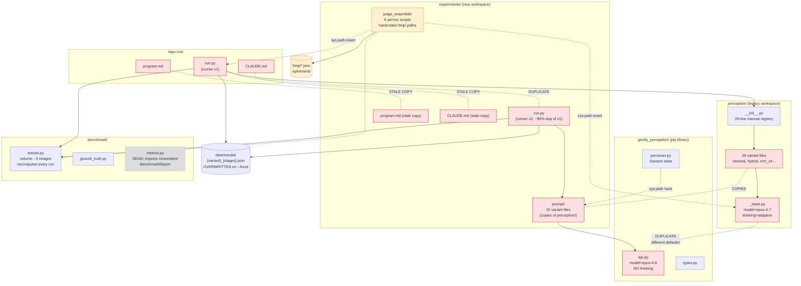
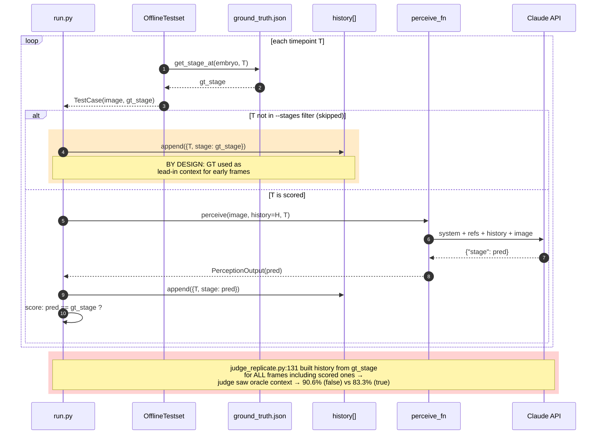
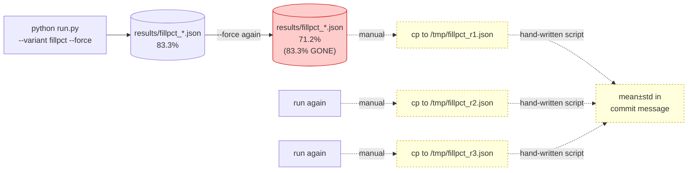
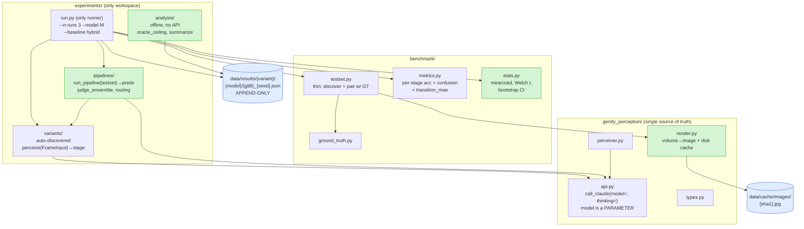
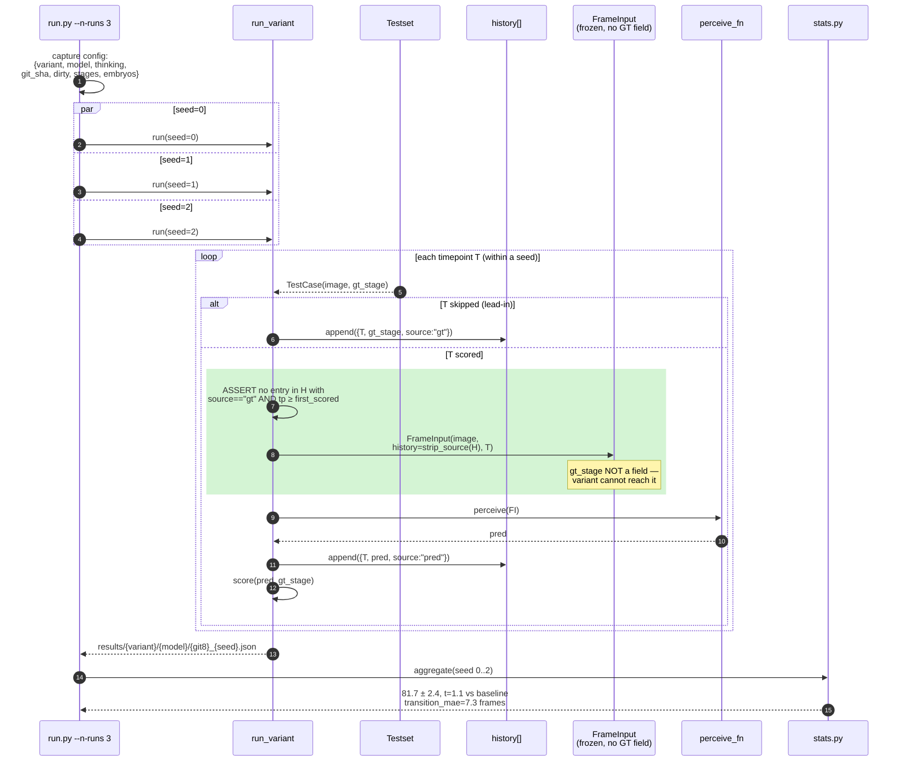
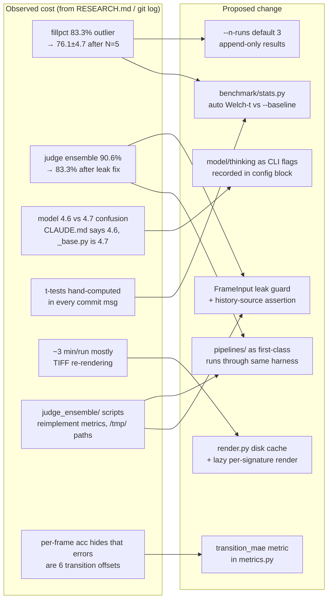
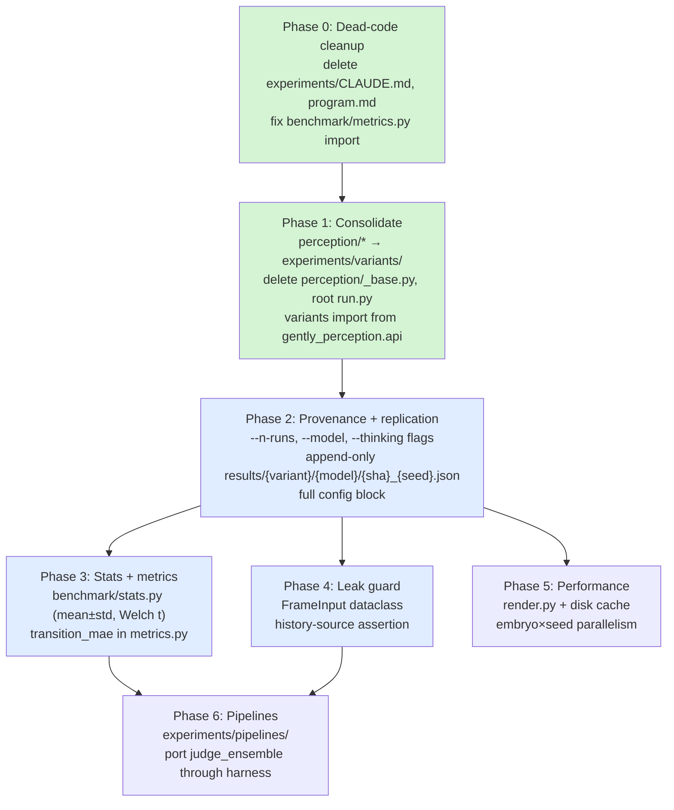

# gently-perception harness design — diagrams

Generated 2026-05-11 from branch `trisha/gently-opus47-experiments` @ `4db3452`.

---

## 1. Current architecture — three-way duplication

**Red** = duplicated · **Grey dashed** = dead code · **Yellow** = escapes the harness

---

## 2. Current eval data flow — where the GT leak lives

The orange band is the **legitimate** GT injection (lead-in for skipped frames). The red band is the **leak**: nothing structurally separates "GT for skipped frames" from "GT for scored frames" — both flow through the same `history` list. One-off scripts that rebuild `history` themselves (judge_replicate.py) get this wrong.

---

## 3. Current result lifecycle — why replication is manual

No run ID, no model recorded, no git SHA. The `/tmp/` copies are gone; the only provenance is the commit message.

---

## 4. Proposed architecture

**Green** = new · **Blue** = persistent storage. One API wrapper, one runner, one variant directory. `perception/` and root `run.py` deleted.

---

## 5. Proposed eval data flow — leak guard + replication

Green band is the **structural leak guard**: GT lives only in the runner's scoring scope; `FrameInput` is a frozen dataclass with no GT field, so variants and pipelines physically can't read it.

---

## 6. Problems → fixes traceability

---

## 7. Migration order (lowest-risk first)

**Green** = mechanical/safe · **Blue** = changes runner contract (re-baseline after)
